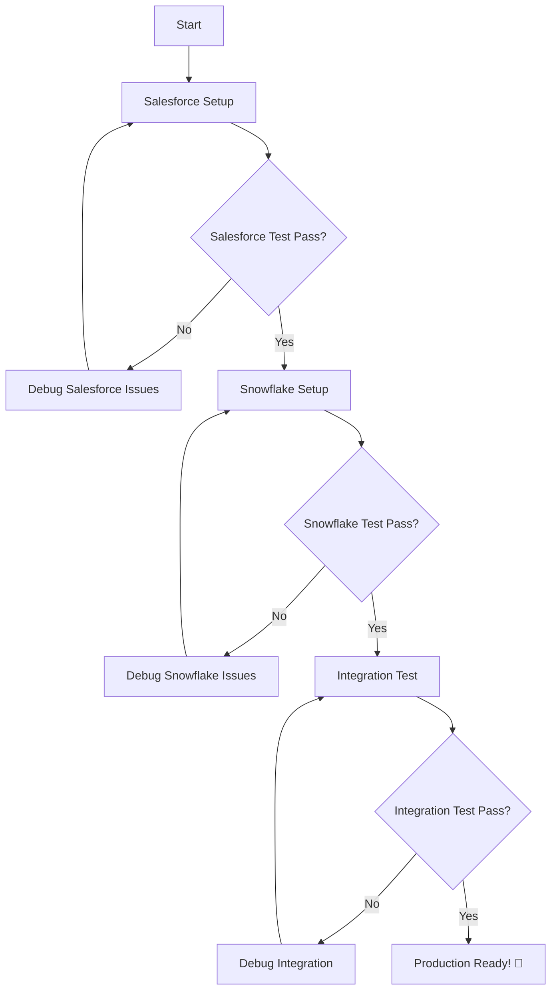

# Snowflake-Salesforce Healthcare Integration

A comprehensive integration solution that enables **Snowflake Agents to manage Salesforce healthcare campaigns and patient contacts** directly through stored procedures with secure credential management.

## 🎯 Project Overview

This project provides production-ready tools to:
- ✅ **Connect Snowflake to Salesforce** using OAuth 2.0 Client Credentials Flow
- ✅ **Manage healthcare campaigns** - create campaigns if they don't exist
- ✅ **Manage patient contacts** - create contacts using patient_id as unique identifier  
- ✅ **Add patients to campaigns** with comprehensive error handling
- ✅ **Secure credential management** using Snowflake Secrets
- ✅ **Agent-compatible procedures** that work with Snowflake Agents

## 🏗️ Architecture

```
┌─────────────────┐    ┌──────────────────┐    ┌─────────────────────┐
│ Snowflake Agent │───▶│ Stored Procedure │───▶│ Salesforce REST API │
│                 │    │ (Python)         │    │                     │
├─────────────────┤    ├──────────────────┤    ├─────────────────────┤
│ • Campaign Name │    │ • OAuth Auth     │    │ • Campaign Objects  │
│ • Patient JSON  │    │ • Contact Mgmt   │    │ • Contact Objects   │
│                 │    │ • Campaign Mgmt  │    │ • CampaignMembers   │
└─────────────────┘    └──────────────────┘    └─────────────────────┘
```

## 🚀 Quick Start

### Step 1: Salesforce Setup (Required First)

Navigate to the Salesforce folder and complete setup:

```bash
cd Salesforce/
# Follow the comprehensive setup guide
open README.md
```

**Key Salesforce Tasks:**
- ✅ Create Salesforce Developer Instance
- ✅ Configure External Client App with Client Credentials Flow (Summer '25+)
- ✅ Set up OAuth policies and permissions
- ✅ Test API connectivity
- ✅ Configure custom patient_id field

### Step 2: Snowflake Integration

After completing Salesforce setup:

```bash
cd ../Snowflake/
# Follow the Snowflake setup guide  
open README.md
```

**Key Snowflake Tasks:**
- ✅ Configure Snowflake connection and database
- ✅ Deploy secure credential management (Snowflake Secrets)
- ✅ Set up external access integration
- ✅ Deploy agent-compatible stored procedures
- ✅ Run comprehensive tests

## 📋 Prerequisites

### Accounts & Access
- **Snowflake Account** with ACCOUNTADMIN privileges
- **Salesforce Developer Account** (free at developer.salesforce.com)

### Tools & Software
- **Snowflake CLI** installed and configured
- **Python 3.11+** with `requests` library
- **Command line access** (Terminal/PowerShell)

### Knowledge Requirements
- Basic understanding of OAuth 2.0
- Familiarity with Snowflake and Salesforce concepts
- Command line usage

## 🎯 Key Features

### 🔐 **Secure Authentication**
- OAuth 2.0 Client Credentials Flow
- Snowflake Secrets for credential management
- No hardcoded credentials in code

### 🏥 **Healthcare-Focused**
- Patient ID as primary identifier
- Healthcare campaign management
- Contact deduplication by patient_id
- HIPAA-conscious data handling

### 🤖 **Agent-Compatible**
- Compatible with Snowflake Agent parameter types
- JSON string input format
- Production-ready error handling

### ⚡ **Production Features**
- Comprehensive error handling and validation
- Detailed logging and status reporting
- Batch processing capabilities
- Connection testing and debugging tools

## 📊 Usage Example

Once setup is complete, the main procedure call is simple:

```sql
CALL SALESFORCE_CAMPAIGN_MANAGER(
    'Healthcare Outreach Q4 2024',
    '[
        {
            "name": "John Doe",
            "patient_id": 100001,
            "email": "john.doe@healthcare.com"
        },
        {
            "name": "Jane Smith", 
            "patient_id": 100002,
            "email": "jane.smith@healthcare.com"
        }
    ]'
);
```

**Expected Result:**
```
CAMPAIGN: Healthcare Outreach Q4 2024 | CAMPAIGN_STATUS: CREATED | 
PATIENTS_REQUESTED: 2 | PATIENTS_SUCCESSFUL: 2 | CONTACTS_CREATED: 2 | 
SUCCESS_RATE: 100.0%
```

## 🗂️ Project Structure

```
├── README.md                          # This file - setup guidance
├── requirements.txt                   # Python dependencies  
├── .gitignore                        # Git ignore rules
├── Salesforce/                       # Salesforce setup & testing
│   ├── README.md                     # Salesforce setup guide
│   ├── Salesforce_test.sh            # Connection test script
│   ├── salesforce_test.py            # Python connection test
│   ├── create_contact.py             # Contact creation testing
│   ├── campaign_contact_manager.py   # Full campaign management
│   ├── Salesforce_API_Reference.md   # Complete API documentation
│   └── [other Salesforce tools...]
└── Snowflake/                       # Snowflake integration
    ├── README.md                     # Snowflake setup guide
    ├── test_snowflake_connection.sh  # Connection test script  
    ├── deploy_agent_procedure.sql    # Main agent-compatible procedure
    ├── snowflake_secrets_setup.sql   # Secure credential setup
    └── [other Snowflake tools...]
```

## 🔄 Setup Process Flow



## 🚨 Important Notes

### ⚠️ **Setup Order Matters**
1. **Salesforce MUST be completed first** - Snowflake needs Salesforce credentials
2. **Test each step** before proceeding to the next
3. **Keep credentials secure** - use the provided secure storage methods

### 🔐 **Security Best Practices**
- ✅ Use Snowflake Secrets for credential storage
- ✅ Never commit `.env` files to version control
- ✅ Use minimal required OAuth scopes
- ✅ Regularly rotate credentials
- ✅ Monitor access logs

### 🏥 **Healthcare Considerations**
- Patient ID is used as the primary identifier (not email)
- Contacts are deduplicated by patient_id to prevent duplicates
- All data handling follows healthcare best practices
- Audit trails are maintained through Snowflake query history

## 🐛 Troubleshooting

### Quick Diagnostic Commands

```bash
# Quick Salesforce credential test (fastest)
cd Salesforce && ./Salesforce_test.sh

# Comprehensive Salesforce validation
cd Salesforce && python test_connection.py

# Test complete Snowflake setup and connectivity
cd Snowflake && ./test_snowflake_connection.sh
```

### Complete Setup Commands

```bash
# Option 1: All-in-one deployment (recommended for testing)
cd Snowflake && snow sql --connection demo_admin_keypair -f 00_snowflake_salesforce_e2e_setup.sql

# Option 2: Step-by-step deployment (recommended for production)
cd Snowflake && snow sql --connection demo_admin_keypair -f 01_snowflake_secrets_setup.sql
cd Snowflake && snow sql --connection demo_admin_keypair -f 02_deploy_agent_procedure.sql

# 3. Test the integration
cd Snowflake && snow sql --connection demo_admin_keypair -f test_agent_compatible_procedure.sql
```

### Common Issues
- **Authentication failures**: Check OAuth settings in Salesforce External Client App
- **Secret access issues**: Verify Snowflake secret names and grants
- **Network connectivity**: Ensure external access integration is properly configured
- **Patient ID conflicts**: Verify patient_id__c field exists and is unique in Salesforce

## 📚 Documentation

Each folder contains comprehensive documentation:
- **`Salesforce/README.md`** - Complete Salesforce setup guide
- **`Snowflake/README.md`** - Complete Snowflake setup guide  
- **`Salesforce/Salesforce_API_Reference.md`** - API function reference
- **Various summary files** - Feature-specific documentation

## 🤝 Support

### Resources
- [Salesforce Developer Documentation](https://developer.salesforce.com/docs)
- [Snowflake Documentation](https://docs.snowflake.com)
- [OAuth 2.0 Client Credentials Flow Guide](https://help.salesforce.com/s/articleView?id=sf.remoteaccess_oauth_client_credentials_flow.htm)

### Getting Help
1. **Check the specific folder README** for detailed guidance
2. **Review debugging sections** in each README
3. **Test individual components** using provided test scripts
4. **Check logs and error messages** for specific guidance

## 🎉 Success Criteria

You'll know the integration is working when:
- ✅ Salesforce connection tests pass
- ✅ Snowflake connection tests pass  
- ✅ Stored procedure deploys successfully
- ✅ Test campaigns and contacts are created in Salesforce
- ✅ Patient lookup works correctly (no duplicates created)
- ✅ Snowflake Agents can call the procedure successfully

---

## Next Steps After Setup

1. **Configure Snowflake Agents** to use the `SALESFORCE_CAMPAIGN_MANAGER` procedure
2. **Set up production schedules** for campaign management
3. **Configure monitoring and alerting** for integration health
4. **Implement role-based access controls** for production security

**Ready to get started? Begin with the [Salesforce Setup Guide](Salesforce/README.md)! 🚀**